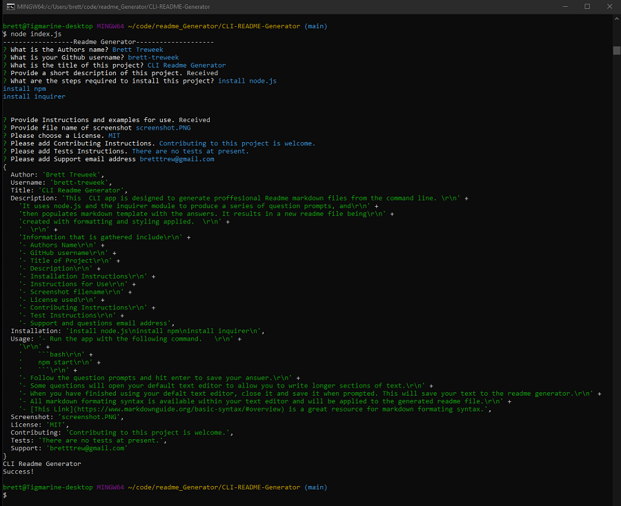

# CLI Readme Generator


## Description

This  CLI app is designed to generate proffesional Readme markdown files from the command line. 
It uses node.js and the inquirer module to produce a series of question prompts, and
then populates markdown template with the answers. It results in a new readme file being
created with formatting and styling applied.  
  
Information that is gathered include
- Authors Name
- GitHub username
- Title of Project
- Description
- Installation Instructions
- Instructions for Use
- Screenshot filename
- License used
- Contributing Instructions
- Test Instructions
- Support and questions email address

---
## Table of Contents

- [Installation](#installation)
- [Usage](#usage)
- [License](#license)
- [Contributing](#contributing)
- [Tests](#tests)
- [Questions](#questions)

---
## Installation

Please follow these steps to install the project and any dependancies.

```bash
install node.js
install npm
install inquirer


```

---
## Usage

[Here is a link to a walkthrough](https://drive.google.com/file/d/1LG07zwsB0G4Ae_E2sGQ7sr7RJHtJlWYS/view)

- Run the app with the following command.   

    ```bash
    npm start
    ```
- If you have a screenshot of your project put it in Assets/Images folder.
- Follow the question prompts and hit enter to save your answer.
- Some questions will open your default text editor to allow you to write longer sections of text.
- When you have finished using your defalt text editor, close it and save it when prompted. This will save your text to the readme generator.
- All markdown formating syntax is available within your text editor and will be applied to the generated readme file.
- [This Link](https://www.markdownguide.org/basic-syntax/#overview) is a great resource for markdown formating syntax.



---
## License

This project is licensed under 

---
## Contributing

Contributing to this project is welcome.

You can contribute to this project at [GitHub](https://github.com/brett-treweek/CLI-README-Generator)

---
## Tests

Please use these commands to perform tests.

```bash

There are no tests at present.

```

---
## Questions

For any questions and support please contact Brett Treweek at bretttrew@gmail.com or message me through [GitHub](https://github.com/brett-treweek).